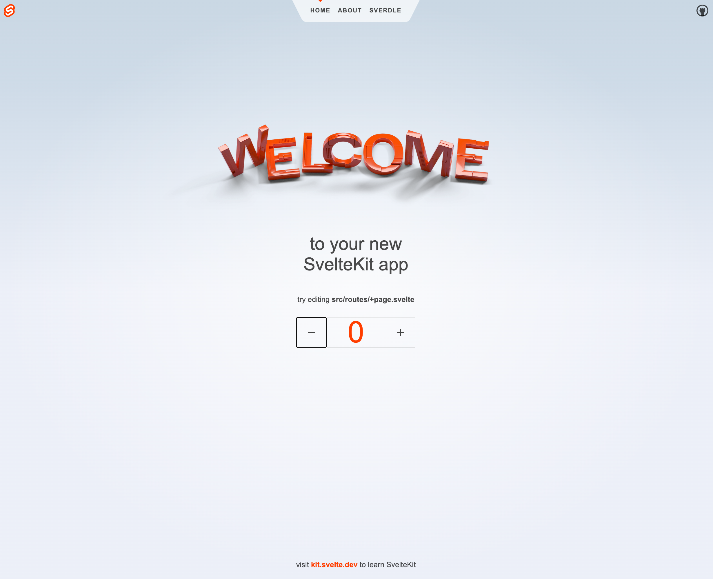
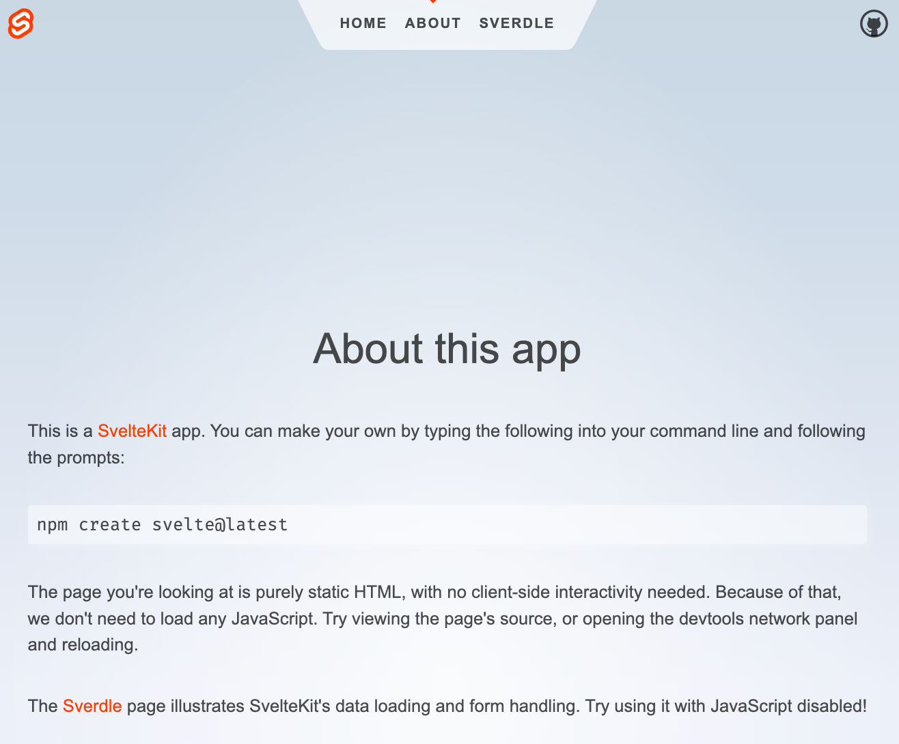
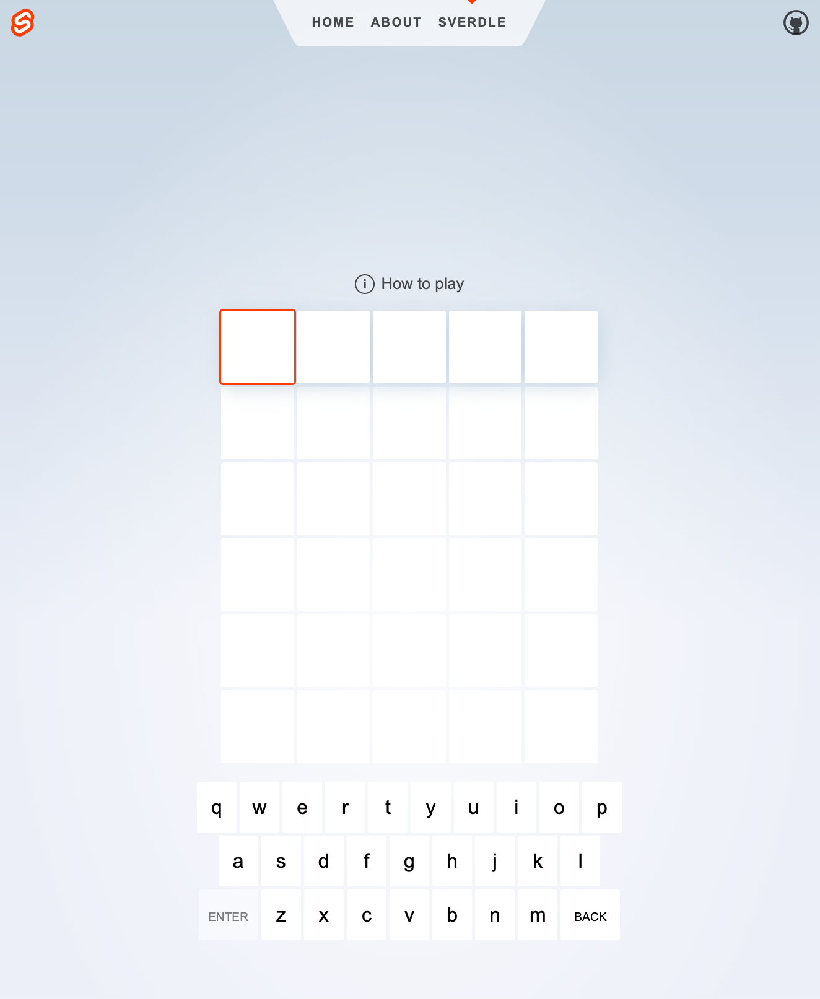
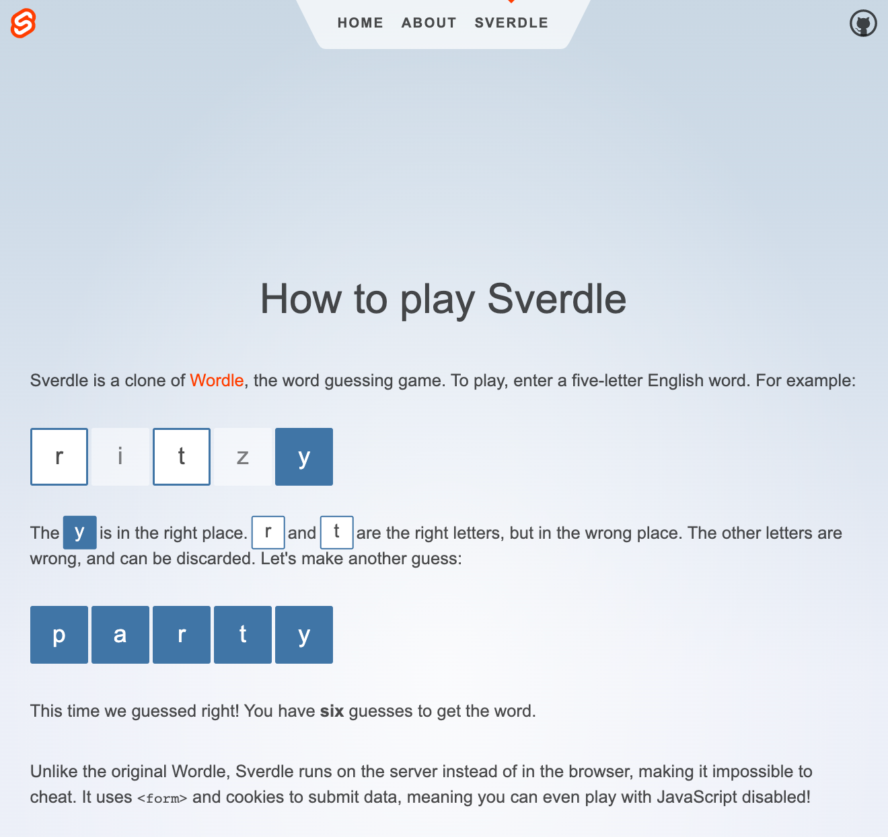
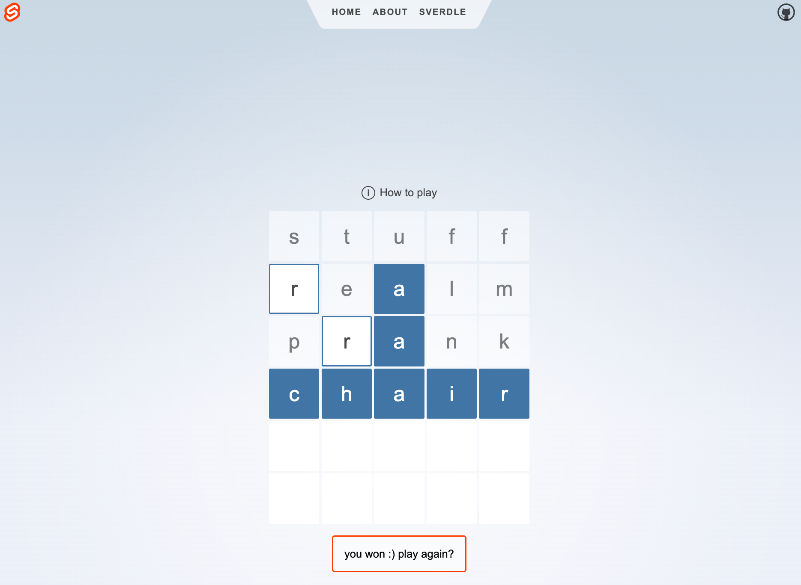

# Getting Started

The [Svelte Tutorial](../001-svelte-tutorial/README.md) is a detailed introduction to Svelte. This [quickstart](https://svelte.dev/docs#getting-started) is the equivalent of a jumpstart introduction for the impatient.

---

## 0. My Dev Environment

 * Visual Studio Code 1.74
 * Node v18.9.0
 * npm v9.6.1

## 1. Scaffold New Project

Create a new project using [SvelteKit](https://kit.svelte.dev/).

```bash
$ npm create svelte@latest my-first-app
```

I selected the default "demo app" option. Then picked _all_ additional options at the end (none were selected by default).

```bash
Need to install the following packages:
  create-svelte@latest
Ok to proceed? (y) 

create-svelte version 3.1.2

┌  Welcome to SvelteKit!
│
◆  Which Svelte app template?
│  ● SvelteKit demo app (A demo app showcasing some of the features of SvelteKit - play a word
guessing game that works without JavaScript!)
│  ○ Skeleton project
│  ○ Library project

│
◆  Add type checking with TypeScript?
│  ● Yes, using JavaScript with JSDoc comments
│  ○ Yes, using TypeScript syntax
│  ○ No
└
│
◆  Select additional options (use arrow keys/space bar)
│  ◼ Add ESLint for code linting
│  ◼ Add Prettier for code formatting
│  ◼ Add Playwright for browser testing
│  ◼ Add Vitest for unit testing
```

The process completes in seconds with this output

```

│  Add ESLint for code linting, Add Prettier for code formatting, Add Playwright for browser
testing, Add Vitest for unit testing
│
└  Your project is ready!

✔ Type-checked JavaScript
  https://www.typescriptlang.org/tsconfig#checkJs

✔ ESLint
  https://github.com/sveltejs/eslint-plugin-svelte3

✔ Prettier
  https://prettier.io/docs/en/options.html
  https://github.com/sveltejs/prettier-plugin-svelte#options

✔ Playwright
  https://playwright.dev

✔ Vitest
  https://vitest.dev

Install community-maintained integrations:
  https://github.com/svelte-add/svelte-add

Next steps:
  1: cd my-first-app
  2: npm install (or pnpm install, etc)
  3: git init && git add -A && git commit -m "Initial commit" (optional)
  4: npm run dev -- --open

To close the dev server, hit Ctrl-C

Stuck? Visit us at https://svelte.dev/chat
```

## 2. Explore App Structure

Let's see what gets scaffolded:

```bash
$ cd my-first-app
$ ls 
  README.md   
  jsconfig.json                
  package.json   
  playwright.config.js       
  src/        
  static/                    
  svelte.config.js    
  tests/  
  vite.config.js     
```

Here's a quick explainer for what we get:
 - [`jsconfig.json`](https://code.visualstudio.com/docs/languages/jsconfig) - indicates that _this_ directory is the root of a JS project. It's used by VS Code.
 - [`package.json`](https://docs.npmjs.com/cli/v7/configuring-npm/package-json) - defines the key package dependencies and scripts for building or running this app.
 - [`playwright.config.js`](https://playwright.dev/docs/test-configuration) - configures the Playwright Test Runner, with `tests/` being the default root folder searched recursively for Playwright test scripts.
  - [`svelte.config.js`](https://kit.svelte.dev/docs/configuration) - identifies this directory as the root of a Svelte project. It's used by SvelteKit and other tooling.
 - [`vite.config.js`](https://vitejs.dev/config/) - configures the Vite build tooling and dev server for this project.
 - `src/` - contains app source code
 - `static/` - contains static assets

In addition, you have hidden dotfiles for configuring (or ignoring) tools like ESLint, Prettier, and npm.


## 3. Preview App In Dev Server

```bash
$ cd my-first-app
$ npm install
$ npm run dev

> my-first-app@0.0.1 dev
> vite dev

Forced re-optimization of dependencies

  VITE v4.1.4  ready in 727 ms

  ➜  Local:   http://localhost:5173/
  ➜  Network: use --host to expose
  ➜  press h to show help
```

Launch the browser to that URL and you should see the app running as shown below. Click the '+' or '-' buttons to increment or decrement the counter, and validate the app is running.



## 4. Build App For Production

Using the following command should build the app for production, _compiling_ the `.svelte` files to HTML/JS/CSS for deployment, where the build files are in the `dist/` folder.

```bash

```bash
$ npm run build
> my-first-app@0.0.1 build
> vite build

vite v4.1.4 building SSR bundle for production...

Run npm run preview to preview your production build locally.

> Using @sveltejs/adapter-auto
  Could not detect a supported production environment. See https://kit.svelte.dev/docs/adapters to learn how to configure your app to run on the platform of your choosing
```

As indicated, you can then use `npm run preview` to preview the _production_ app locally. Note that this launches on a different port than dev mode.

```bash
$ npm run preview

> my-first-app@0.0.1 preview
> vite preview

  ➜  Local:   http://localhost:4173/
  ➜  Network: use --host to expose
```

## 5. Explore the App

If you look at the screenshot above (or preview the app in browser) you notice that it has three routes:
 - `/` - the home page (what you see)
 - `/about` - a simple about page
 - `/sverdle` - a word-guessing game page

And if you look at the last page, you see a `How to Play` link that takes you to a fourth route:
 - `/sverdle/howtoplay` - a page with game instructions

The screenshots for the About, Sverdle, and HowToPlay pages, are shown below.





You play the game by guessing the word and getting visual feedback. Here is a screenshot of a _played game_ that was won. Note the styling of letters to show correct guesses for letter existence and letter placement.




## 6. Explore the Code

Now let's dive into the source code to see how this is implemented.

```bash
$ ls src/
app.d.ts 
app.html 
lib/   
  images/
    github.svg         
    svelte-welcome.png
    svelte-logo.svg  
    svelte-welcome.webp
routes/
  +layout.svelte  
  +page.js    
  +page.svelte  
  Counter.svelte    
  Header.svelte 
  about/   
    +page.js
    +page.svelte    
  styles.css    
  sverdle/
    +page.server.js
    +page.svelte
    game.js
    game.test.js
    howtoplay/
      +page.js
      +page.svelte
    reduced-motion.js
    words.server.js
```

Learn more about the [project structure](https://kit.svelte.dev/docs/project-structure). For now, its good to know the following:
 - `src/app.html` - is the page template
 - `src/routes/` - contains the routes for the app
 - `lib/` - contains utilities & components
 - `*.test.js` - files within `src/` are Vitest-generated unit test scripts.

## 7. Congratulations!

At this point we've validated that we can build and run a SvelteKit app in our local development environment. Now we can dive into a more elaborate tutorial that explores the code syntax, semantics and structure in more detail. 

From the Svelte API documentation, we know we need to learn about:
 - [Svelte Component Formats](https://svelte.dev/docs#component-format)
 - [Svelte Template Syntax](https://svelte.dev/docs#template-syntax) - Tags, Attributes, Directives and more
 - [Svelte Runtime](https://svelte.dev/docs#run-time) = lfiecycle functions and context API
 - [Svelte Compile Time](https://svelte.dev/docs#compile-time) - understand compiler options (convert .svelte to .js)
 - [Accessibility Warnings](https://svelte.dev/docs#accessibility-warnings) - list of a11y checks done at compile time!

Let's dive into the [SvelteKit Tutorial](./../001-svelte-tutorial/README.md) next to figure these out!