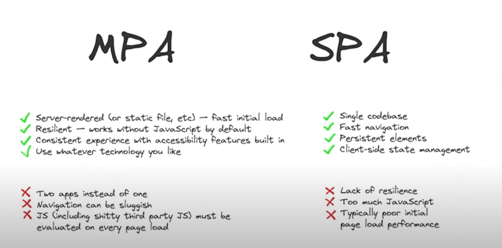

[**SvelteKit v1.0**](https://svelte.dev/blog/announcing-sveltekit-1.0) was released on Dec 14, 2022 as the _recommended way_ to build Svelte apps. It came with [**refreshed docs**](https://kit.svelte.dev/docs/introduction) and an experimental [**interactive tutorial**](https://learn.svelte.dev/tutorial/welcome-to-svelte) to learn the concepts, making this a good time to dive in.

## What is **Svelte**?

Svelte is a _UI component framework_ like React and Vue, but with a radically different approach. Instead of declarative UI, Svelte runs at _build time_ to convert components into imperative code that "surgically updates the DOM". This eliminates runtime penalties paid for v-DOM operations and makes app more performant.
 * [**See the Docs**](https://svelte.dev/docs) to learn component formats and template syntax.
 * [**Explore Examples**](https://svelte.dev/examples/hello-world) in the interactive online playground.

## What is **SvelteKit**?

> "SvelteKit is a framework for rapid development of robust, performant web applications."

Svelte is a _component framework_ while SvelteKit is an _application framework_ built on top of Svelte. Its decisions were based on feedback from beta testers, and from best practices seen in frameworks like [Next.js](https://nextjs.org/) and [Remix](https://remix.run/). Here are a few things it does differently:

 1. Defaults to client-side navigation after initial server-rendered page load (_unlike multi-page app or MPA frameworks_).
 2. Allows you to use one language (JS) instead of two (HTML+JS) (_ergo, it runs in any JS runtime, including Node.js_)
 3. Allows building with dynamic data without perf/glitch issues (_compared to static site generators_).
 4. Provides _flexibility_ in making rendering choices and more at the granularity you need.

## Re: [**Transitional Apps**](https://www.youtube.com/watch?v=860d8usGC0o) (2021)

Web devs often contrast traditional (multi-page apps) and modern (single-page apps) approaches in development.
 - MPA = 2 apps in one. The first app (initial render) is HTML, the second app (dynamic updates) requires JS.
 - SPA = 1 app downloaded (JS). Can update pages in-place (less round-trip to server) but it has drawbacks in performance, accessibility and JS dependency (complex tooling, less resilient). This "JS-heavy" approach can "ruin the web" (traditional HTML experiences) but also unlock rich behaviors (play media while scrolling).

_Image Credit: [Rich Harris, JamStack TV 2021](https://www.youtube.com/watch?v=860d8usGC0o)_

Inspired by _"traditional design"_ (having the best of both worlds) - recognizing that app development is in a constant state of evolution. Frequent objections raised:
 - Send HTML chunks not Data => leads to inconsistent state, flashes of invalid content
 - Documents vs. Apps => not a dichotomy, but a spectrum
 - Trends in JS favor => Edge Functions (cheap, fast, WASM-driven)
 - JavaScript bloat => third-party add-ins, hydration costs etc.

This is the promise of Svelte/SvelteKit:

 - Static pre-rendering with client-side interactivity. Pre-rendered page with zero JavaScript
 - Dynamically server-side rendered page that works without JS, but delivers enhanced UI/UX with JS.
 - API endpoint (data) to power the page, with Edge Functions + CDN  (no administration)
 - Single codebase (Svelte) + Powerful tooling (Vite)

## Where to Next?

Walk through the new [interactive tutorial](https://learn.svelte.dev/tutorial/welcome-to-svelte) and get some hands-on experience with Svelte/SvelteKit concepts and tooling.